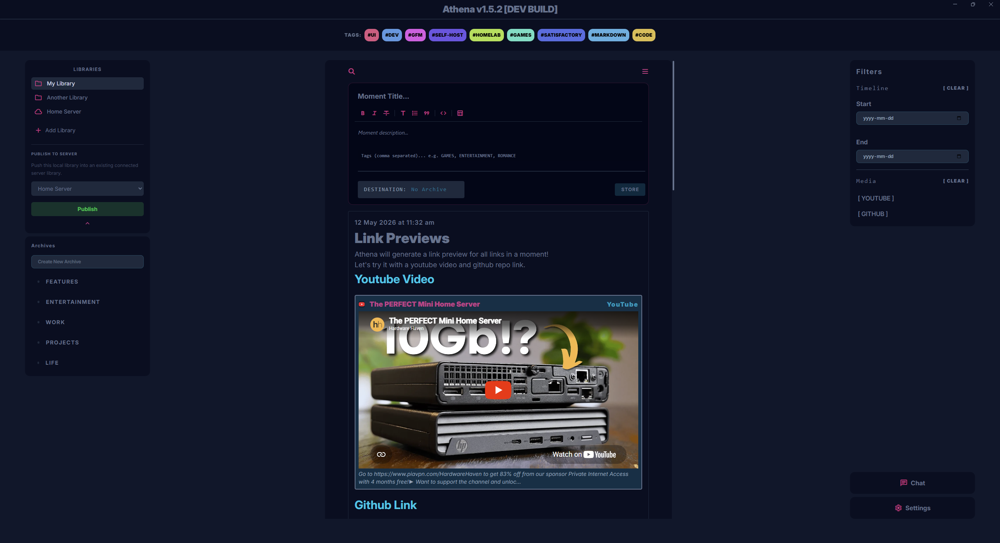
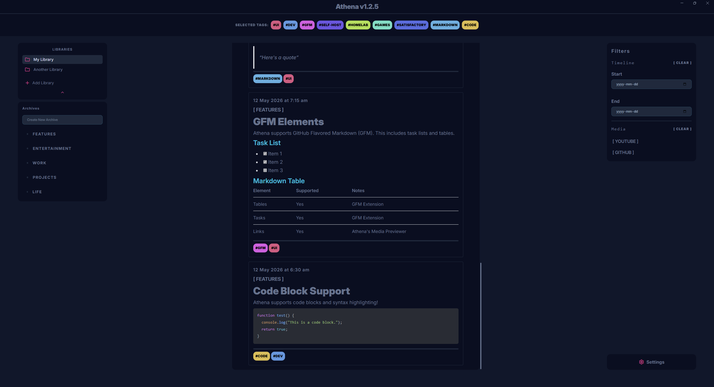
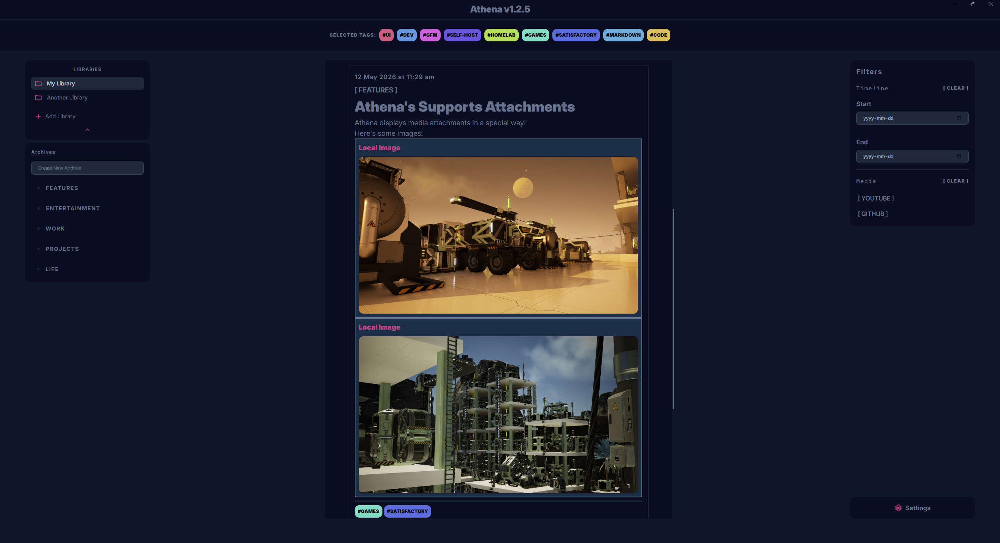
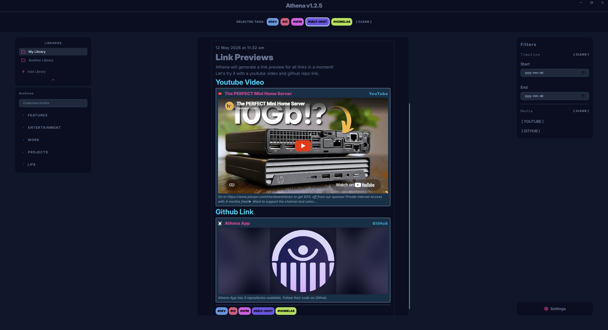
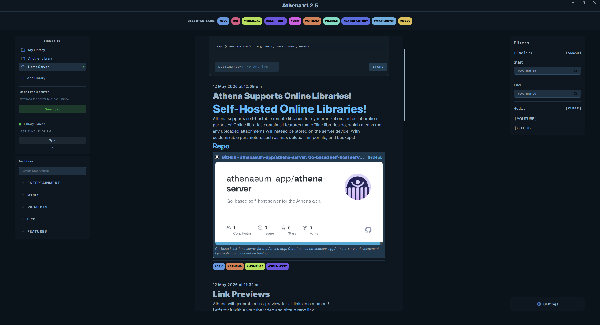
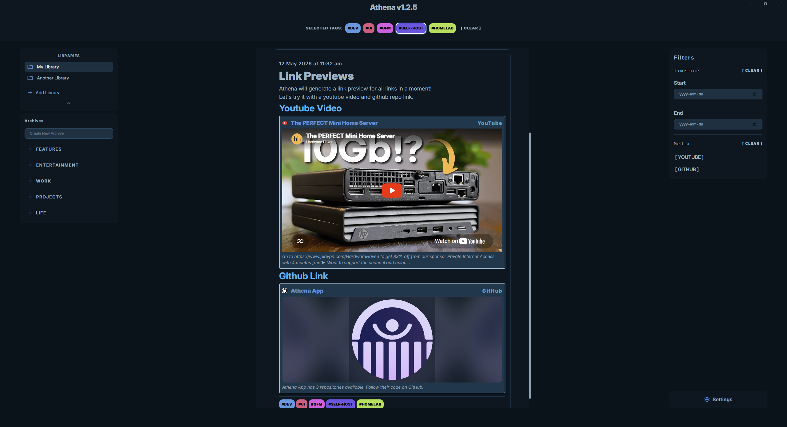
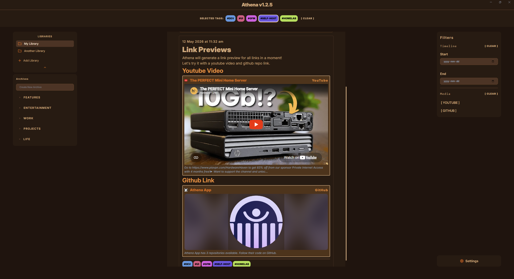
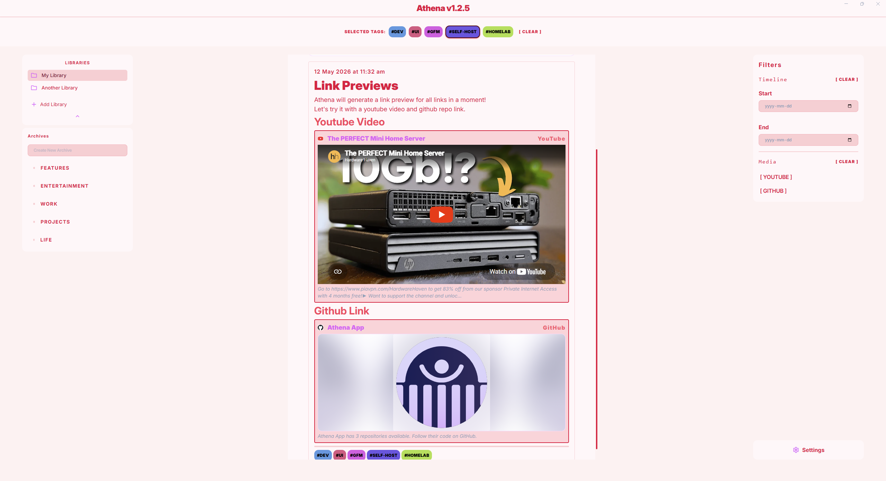
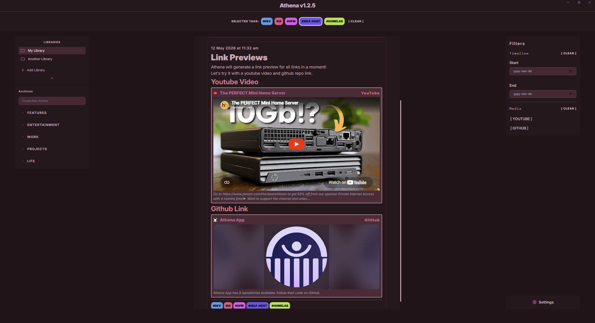
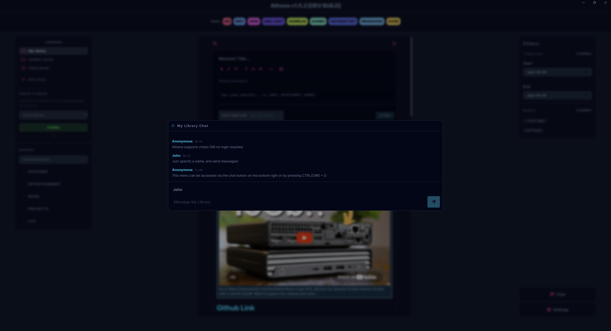

# Athena Client
The official desktop client for Athena. Log your thoughts and ideas in a personal, easily filterable journal, with full offline/online support.



## Features
* **Offline-First:** Athena is completely usable even without an internet connection, with all data stored locally (see exception below). Athena requires no sort of logins at all.
* **Optional Online Servers:** Connect to a self-hosted Athena Server to securely sync libraries across devices and share with others via an IP and password. See the [Athena Server Repository](https://github.com/athenaeum-app/athena-server/blob/master/README.md) for more information.
* **Simple Organization:** Organize your thoughts into various Libraries, Archives, Moments, and use smart tags to organize and search your moments.
* **Rich Media & Link Previews:** Drop in images, videos, and links to automatically generate rich visual previews.
* **Markdown Support:** Create and edit moments using standard Markdown syntax.
* **GitHub Flavored Markdown (GFM):** Use enhanced Markdown rendering with GFM support for tables, task lists, and more.
* **Syntax Highlighting:** Code blocks within your moments will be highlighted using highlight.js for improved readability.
* **Chat:** Send and receive chat messages per library. Also available for offline libraries, for short and quick logging. No logging in is required.

---
## Images

### Rich Text & Markdown
Athena supports standard Markdown, link previews and file previews, as well as advanced GFM elements like tables and task lists.
| Markdown | GFM |
| :---: | :---: |
|  |  |

### Attachments & Media
Drop in your files or paste web links to automatically generate beautiful visual cards.
| Attachments | Link Previews |
| :---: | :---: |
|  |  |

### Self-hosted Online Libraries
Athena supports online libraries! No accounts needed, just an IP address and a password. Kept simple on purpose.



### Example Themes
Athena comes with multiple built-in dynamic color themes to suit your aesthetic. 

| Theme 1 (Default) | Theme 2 |
| :---: | :---: |
|  |  |
| **Theme 3** | **Theme 4** |
|  |  |

#### Chat
Athena supports chat functionality, for both online and offline libraries. Chat's are library-level, so each library has its own chat history and messages. Currently, up to the last 500 messages are kept for offline data, and all messages are kept for online libraries.



---

## Development Setup
To build and run the Athena client locally, ensure you have Node.js installed.

1. Clone the repository and install dependencies:
```bash
npm install

```

2. Start the development server:

```bash
npm run dev

```

---

## Building for Production

To package the application into a standalone executable for your operating system:

```bash
npm run make

```
